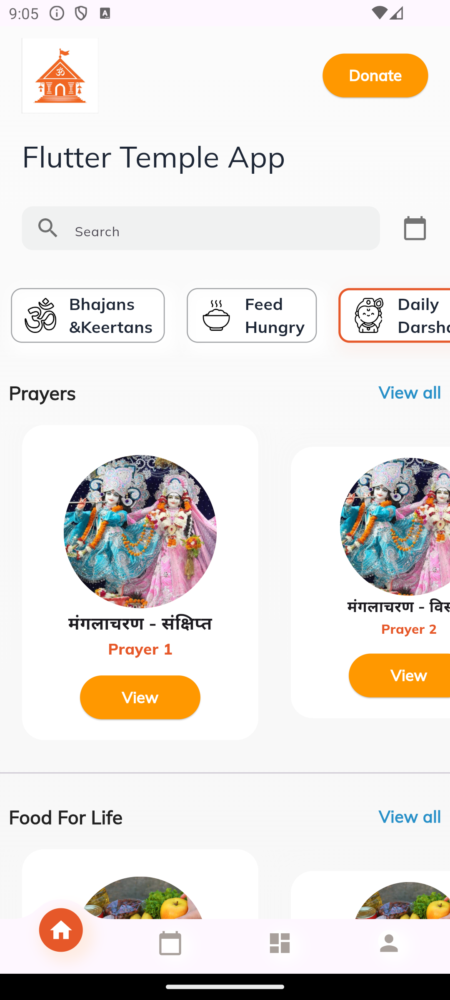

# Temple Inspired Flutter App 🙏


---

## 📖 About
This is a **Flutter-based mobile application** inspired by temple apps.  
The app is designed to:
- Provide an elegant and simple interface
- Allow offline access for core features
- Support multiple languages dynamically
- Offer customizable themes for better user experience

---

## ⚠️ Disclaimer
All **images, content, and references** used in this application are taken from publicly available internet sources.  
This application is **only inspired** by spiritual/temple chains and is **not an official application** of any organization.

---

## ✨ Features
- 📱 Responsive UI (Mobile, Tablet, Web)
- 🌐 Multi-language support (dynamic switching)
- 🎨 Dynamic theme customization
- 📦 Offline accessibility
- 🖼️ Image & content sections with disclaimer
- ⚡ Clean Flutter architecture (Provider/Riverpod)

---

## 📸 Screenshots

| Home Screen | About Screen | Disclaimer Screen |
|-------------|--------------|-------------------|
|  |  |  |

*(Add your own screenshots in `assets/screenshots/` and update paths)*

---

## 🚀 Getting Started

### 1️⃣ Clone the repository
```bash
git clone https://github.com/USERNAME/temple_app.git
cd temple_app
